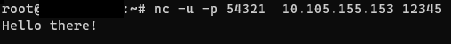

# TrivialUdpServer
Trivial UDP server in a HoloLens Unity app

## Building
1) Clone the repo to your local machine
2) Use the [Mixed Reality Feature Tool](https://docs.microsoft.com/en-us/windows/mixed-reality/develop/unity/welcome-to-mr-feature-tool) to add the following packages:
    
3) Open in Unity and open up Scenes/UdpServerScene and hit play
4) You can also then build for HoloLens

## Running
1) Run the UdpServerScene in the Editor or build it and deploy to the HoloLens
2) You'll see your IP address
3) Use some utility to send UDP messages to that IP address and port

Linux NC command:

What you see on the device or in the Unity Editor:

## Sample code
The interesting sample code is in the [UdpServer.cpp](/Assets/Scripts/UdpServer.cs) file.  It's just a MonoObject that opens up a UDP port and echos what it receives to a TextMesh instance and the Unity player log

